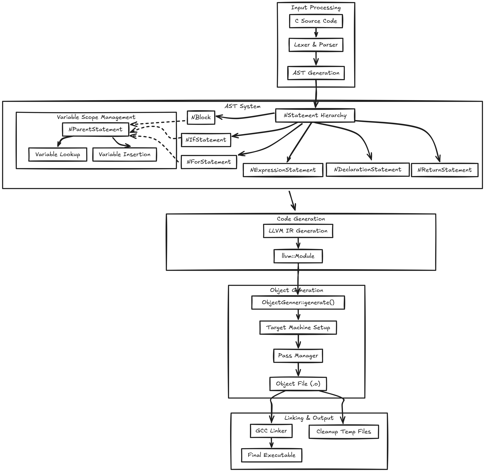

# Overview

## Purpose and Scope
This document provides a high-level introduction to the toyc compiler project, its architecture, and core capabilities. The toyc compiler is a C language compiler that transforms C source code into executable binaries using a traditional lexing/parsing frontend combined with LLVM for optimization and code generation.

This overview covers the fundamental concepts, major system components, and compilation pipeline. For detailed information about specific subsystems, see:

* Architecture details: Architecture Overview
* Compilation process: Compilation Pipeline
* AST implementation: AST System
* LLVM integration: LLVM Integration and Code Generation

## What is toyc
toyc is a C compiler implementation that follows traditional compiler design principles while leveraging modern infrastructure. The compiler accepts C source files and produces executable binaries through a multi-stage compilation process.

The compiler implements a subset of the ANSI C grammar and uses the following key technologies:

Lex for lexical analysis
* Yacc for parsing and AST construction
* LLVM for intermediate representation, optimization, and code generation
* GCC for final linking

## System Architecture
The following diagram shows the major system components and their relationships using actual code entities from the codebase:

This architecture demonstrates the clean separation between parsing (frontend), code generation (LLVM backend), object file creation, and final linking stages.

## Key System Components
The following table summarizes the major components and their responsibilities:

|Component|Code Entity|Primary Responsibility|
|---|---|---|
|Main Controller|`main()` in src/toyc.cpp|Command-line processing, orchestrates compilation pipeline|
|File Parser|`toyc::parser::parseFile`|Lexical analysis, parsing, AST construction|
|AST Root|`NExternalDeclaration* program`|Root of abstract syntax tree, program representation|
|Code Generator AST|`codegen()` methods	Convert AST nodes to LLVM IR
|Optimizer|`llvm::legacy::PassManager`|Apply LLVM optimization passes
|Object Generator|`toyc::obj::ObjectGenner`|Generate object files from LLVM modules
|Error Handler|`toyc::utility::ErrorHandler`|Centralized error reporting and logging|

## Command-Line Interface
The toyc compiler provides a simple command-line interface with the following options:

* Basic compilation: `./toyc input.c -o output`
* LLVM IR emission: `./toyc input.c -l -o output` (creates output.ll)
* Help: `./toyc -h or ./toyc --help`

The compiler automatically handles:

* Temporary object file creation using TMP_FILE_NAME ("%%%%TMP%%%%.o")
* LLVM optimization passes including memory promotion, reassociation, and CFG simplification
* Final linking with math library (-lm) through GCC

## Supported C Features
### Data Types
The compiler supports basic C data types including:
- `bool`, `char`, `short`, `int`, `long`, `float`, `double`, `void`
- Pointer types (indicated by the `*` operator)

### Function Definitions
The compiler supports function definitions with parameters and return types, including:
- Functions with parameter lists
- Functions with no parameters
- Function declarations (prototypes)
- Variadic functions using ellipsis (`...`)

### Control Flow Statements
- `if`/`else` statements
- `switch` statements with `case` and `default` labels
- `for`/`while`/`do-while` loops
- `return`/`break`/`continue` statements
- `goto` statements with label definitions and jumps

### Expressions and Operators
The compiler supports a comprehensive set of expressions including:

**Operators:**
- Arithmetic: `+`, `-`, `*`, `/`, `%`
- Comparison: `==`, `!=`, `<`, `>`, `<=`, `>=`
- Logical: `&&`, `||`
- Ternary conditional: `? :`
- Increment/decrement: `++`, `--` (both prefix and postfix)
- Address and dereference: `&`, `*`
- Basic assignment: `=`
- Compound assignment: `+=`, `-=`, `*=`, `/=`, `%=`
- Shift operators: `<<`, `>>` and their compound assignments `<<=`, `>>=`

### Literals and Constants
- Integer constants (decimal, octal, hexadecimal)
- Floating-point constants
- String literals

### Variable Declarations
The compiler supports variable declarations with optional initialization

### Function Calls
Function calls with argument lists are supported

### Structures
The compiler supports structure definitions and member access using the dot (`.`) and arrow (`->`) operators.

## Future Work
This is a educational/toy C compiler that implements a significant subset of C functionality, but it's not a complete C implementation. Notable limitations include the absence of:
- Arrays and array indexing
- Global variables and static storage duration
- Full support for type qualifiers (e.g., `const`, `volatile`)
- More operators (e.g., bitwise operators, conditional operator)

## References

- [LLVM Documentation](https://llvm.org/docs/)
- [C Language Specification](https://www.lysator.liu.se/c/ANSI-C-grammar-y.html)
- [Image Generation](https://excalidraw.com/)
- [Docs Generation](https://deepwiki.com/)